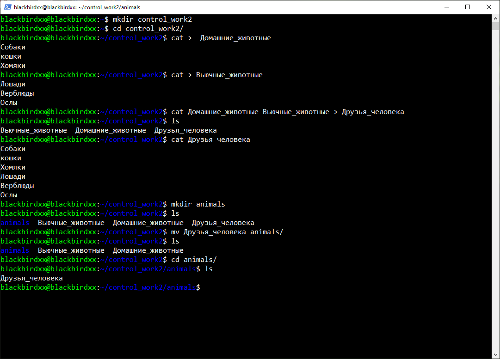

## Итоговая контрольная работа

## Информация о проекте
Необходимо организовать систему учета для питомника в котором живут
домашние и вьючные животные.

## 1 Часть : Linux.

1. Используя команду cat в терминале операционной системы Linux, создать
два файла Домашние животные (заполнив файл собаками, кошками,
хомяками) и Вьючные животными заполнив файл Лошадьми, верблюдами и
ослы), а затем объединить их. Просмотреть содержимое созданного файла.
Переименовать файл, дав ему новое имя (Друзья человека).

2. Создать директорию, переместить файл туда



3. Подключить дополнительный репозиторий MySQL. Установить любой пакет из этого репозитория.


4. Установить и удалить deb-пакет с помощью dpkg.

Установка :

Удаление : 


5. Выложить историю команд в терминале ubuntu

[История команд](data\Hystory.txt "История тут")

## 2 Часть : MySQL.

6. Нарисовать диаграмму, в которой есть класс родительский класс, домашние животные и вьючные животные, в составы которых в случае домашних животных войдут классы: собаки, кошки, хомяки, а в класс вьючные животные войдут: Лошади, верблюды и ослы).


7. В подключенном MySQL репозитории создать базу данных “Друзья
человека”

```sql
DROP DATABASE IF EXISTS human_friends;
CREATE DATABASE human_friends;
USE human_friends;

```
8. Создать таблицы с иерархией из диаграммы в БД

```sql
DROP TABLE IF EXISTS animals;
CREATE TABLE animals (
	Id INT AUTO_INCREMENT PRIMARY KEY,
    animal_type VARCHAR(50)
    );

INSERT INTO animals (animal_type) VALUES 
('Домашние'),
('Вьючные'); 

DROP TABLE IF EXISTS pets;
CREATE TABLE pets (
	id INT AUTO_INCREMENT PRIMARY KEY,
    pet_type VARCHAR(50),
    type_id INT NOT NULL,
    FOREIGN KEY (type_id) REFERENCES animals(Id) ON DELETE CASCADE ON UPDATE CASCADE
);

INSERT INTO pets (pet_type, type_id) VALUES 
('Кошки', 1),
('Собаки', 1),  
('Хомяки', 1); 

DROP TABLE IF EXISTS pack_animals;
CREATE TABLE pack_animals (
	id INT AUTO_INCREMENT PRIMARY KEY,
    pack_animals_type VARCHAR(50),
    type_id INT,
    FOREIGN KEY (type_id) REFERENCES animals (id) ON DELETE CASCADE ON UPDATE CASCADE
);

INSERT INTO pack_animals (pack_animals_type, type_id) VALUES 
('Лошади', 2),
('Верблюды', 2),  
('Ослы', 2);
```

9. Заполнить низкоуровневые таблицы именами(животных), командами
которые они выполняют и датами рождения


```sql

DROP TABLE IF EXISTS cats;
CREATE TABLE cats 
(       
    Id INT AUTO_INCREMENT PRIMARY KEY, 
    Name VARCHAR(50), 
    Commands VARCHAR(50),
    Birthday DATE,
    pet_type INT,
    Foreign KEY (pet_type) REFERENCES pets(type_id) ON DELETE CASCADE ON UPDATE CASCADE
);

INSERT INTO cats (Name,  Commands, Birthday, pet_type) VALUES 
('Васька', 'Свалить горшок', '2020-01-01', 1),
('Киса', "Мяукнуть", '2022-01-02', 1),  
('Мурзик', 'Скребсти дверь',  '2023-01-02', 1); 

DROP TABLE IF EXISTS dogs;
CREATE TABLE dogs 
(       
    Id INT AUTO_INCREMENT PRIMARY KEY, 
    Name VARCHAR(50), 
    Commands VARCHAR(50),
    Birthday DATE,
    pet_type INT,
    Foreign KEY (pet_type) REFERENCES pets(type_id) ON DELETE CASCADE ON UPDATE CASCADE
);

INSERT INTO dogs (Name,  Commands, Birthday, pet_type) VALUES 
('Лорд', 'Сторожить дом', '2020-01-01', 1),
('Барон', "Голос", '2022-01-02', 1),  
('Джек', 'Дай лапу',  '2023-01-02', 1); 

DROP TABLE IF EXISTS hamsters;
CREATE TABLE hamsters 
(       
    Id INT AUTO_INCREMENT PRIMARY KEY, 
    Name VARCHAR(50), 
    Commands VARCHAR(50),
    Birthday DATE,
    pet_type INT,
    Foreign KEY (pet_type) REFERENCES pets(type_id) ON DELETE CASCADE ON UPDATE CASCADE
);

INSERT INTO hamsters (Name,  Commands, Birthday, pet_type) VALUES 
('Борька', 'Спать', '2020-01-01', 1),
('Буба', "Бегать в колесе", '2022-01-02', 1),  
('Варя', 'Прятать еду',  '2023-01-02', 1); 

DROP TABLE IF EXISTS horses;
CREATE TABLE horses 
(       
    Id INT AUTO_INCREMENT PRIMARY KEY, 
    Name VARCHAR(50), 
    Commands VARCHAR(50),
    Birthday DATE,
    pet_type INT,
    Foreign KEY (pet_type) REFERENCES pack_animals(type_id) ON DELETE CASCADE ON UPDATE CASCADE
);

INSERT INTO horses (Name,  Commands, Birthday, pet_type) VALUES 
('Богиня', 'Скакать', '2020-01-01', 2),
('Воландеморт', "Работать в поле", '2022-01-02', 2),  
('Бурый', 'Учавствовать в соревнованиях',  '2023-01-02', 2); 

DROP TABLE IF EXISTS camels;
CREATE TABLE camels 
(       
    Id INT AUTO_INCREMENT PRIMARY KEY, 
    Name VARCHAR(50), 
    Commands VARCHAR(50),
    Birthday DATE,
    pet_type INT,
    Foreign KEY (pet_type) REFERENCES pack_animals(type_id) ON DELETE CASCADE ON UPDATE CASCADE
);

INSERT INTO camels (Name,  Commands, Birthday, pet_type) VALUES 
('Караван', 'Нести груз', '2020-01-01', 2),
('Вредина', "Плюнуть в лицо", '2022-01-02', 2),  
('Шерстяной', 'Жевать колючку',  '2023-01-02', 2); 

DROP TABLE IF EXISTS donkeys;
CREATE TABLE donkeys 
(       
    Id INT AUTO_INCREMENT PRIMARY KEY, 
    Name VARCHAR(50), 
    Commands VARCHAR(50),
    Birthday DATE,
    pet_type INT,
    Foreign KEY (pet_type) REFERENCES pack_animals(type_id) ON DELETE CASCADE ON UPDATE CASCADE
);

INSERT INTO donkeys (Name,  Commands, Birthday, pet_type) VALUES 
('Донкихот', 'Атаковать мельницу', '2020-01-01', 2),
('Ушастый', "Упрямиться", '2022-01-02', 2),  
('Серый', 'Нести груз',  '2023-01-02', 2); 
```
Получаем такой результат заполнения :


10. Удалить из таблицы верблюдов, т.к. верблюдов решили перевезти в другой питомник на зимовку. 

```sql
SET SQL_SAFE_UPDATES = 0;
DELETE FROM pack_animals
WHERE pack_animals_type = 'Верблюды';
```
Сама таблица "Верблюды" осталась, но связей у нее с остальными таблицами больше нет.


Объединить таблицы лошади, и ослы в одну таблицу.
```sql
SELECT Name,  Commands, Birthday, pet_type FROM horses
UNION 
SELECT  Name,  Commands, Birthday, pet_type FROM donkeys;
```

11. Создать новую таблицу “молодые животные” в которую попадут все животные старше 1 года, но младше 3 лет и в отдельном столбце с точностью до месяца подсчитать возраст животных в новой таблице

```sql
DROP TABLE IF EXISTS young_animals;
CREATE TABLE young_animals
SELECT Name,  Commands, Birthday, pet_type, TIMESTAMPDIFF(MONTH, Birthday, CURDATE()) AS Months FROM cats
WHERE Birthday BETWEEN ADDDATE(curdate(), INTERVAL -3 YEAR) AND ADDDATE(CURDATE(), INTERVAL -1 YEAR)
UNION
SELECT Name,  Commands, Birthday, pet_type, TIMESTAMPDIFF(MONTH, Birthday, CURDATE()) AS Months FROM dogs
WHERE Birthday BETWEEN ADDDATE(curdate(), INTERVAL -3 YEAR) AND ADDDATE(CURDATE(), INTERVAL -1 YEAR)
UNION
SELECT Name,  Commands, Birthday, pet_type, TIMESTAMPDIFF(MONTH, Birthday, CURDATE()) AS Months FROM hamsters
WHERE Birthday BETWEEN ADDDATE(curdate(), INTERVAL -3 YEAR) AND ADDDATE(CURDATE(), INTERVAL -1 YEAR)
UNION
SELECT Name,  Commands, Birthday, pet_type, TIMESTAMPDIFF(MONTH, Birthday, CURDATE()) AS Months FROM horses
WHERE Birthday BETWEEN ADDDATE(curdate(), INTERVAL -3 YEAR) AND ADDDATE(CURDATE(), INTERVAL -1 YEAR)
UNION
SELECT Name,  Commands, Birthday, pet_type, TIMESTAMPDIFF(MONTH, Birthday, CURDATE()) AS Months FROM donkeys
WHERE Birthday BETWEEN ADDDATE(curdate(), INTERVAL -3 YEAR) AND ADDDATE(CURDATE(), INTERVAL -1 YEAR);
```
Результат :
 


12. Объединить все таблицы в одну, при этом сохраняя поля, указывающие на прошлую принадлежность к старым таблицам.

```sql
SELECT 'animals' AS where_from, animal_type AS Name, null AS Commands, null AS Вate_of_birth, Id AS Connection_id, null AS Month FROM animals
UNION
SELECT 'pets' AS where_from, pet_type AS Name, null, null, type_id, null  FROM pets
UNION
SELECT 'pack_animals' AS where_from, pack_animals_type AS Name, null, null, type_id, null  FROM pack_animals
UNION
SELECT 'cats' AS where_from, Name,  Commands, Birthday, pet_type, TIMESTAMPDIFF(MONTH, Birthday, CURDATE())  FROM cats
UNION
SELECT 'dogs' AS where_from, Name,  Commands, Birthday, pet_type, TIMESTAMPDIFF(MONTH, Birthday, CURDATE())  FROM dogs
UNION
SELECT 'hamsters' AS where_from, Name,  Commands, Birthday, pet_type, TIMESTAMPDIFF(MONTH, Birthday, CURDATE())  FROM hamsters
UNION
SELECT 'horses' AS where_from, Name,  Commands, Birthday, pet_type, TIMESTAMPDIFF(MONTH, Birthday, CURDATE())  FROM horses
UNION
SELECT 'donkeys' AS where_from, Name,  Commands, Birthday, pet_type, TIMESTAMPDIFF(MONTH, Birthday, CURDATE())  FROM donkeys
UNION 
SELECT 'young_animals' AS where_from, Name,  Commands, Birthday, pet_type, TIMESTAMPDIFF(MONTH, Birthday, CURDATE())  FROM young_animals
;
```
Результат :
 


[Файл со скриптом](data\SqlScript.sql "Скрипт целиком")
